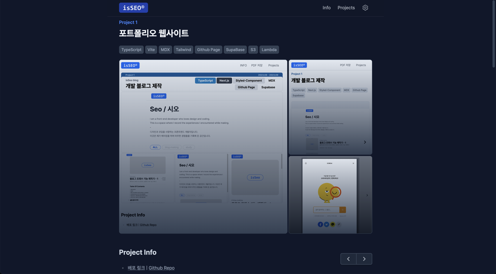

# 포트폴리오 사이트

| Info Page - PC                   | Info Page - Mobile                  |
| -------------------------------- | ----------------------------------- |
|  |  |

| Project Page - PC                   | Project Page - Mobile                   |
| ----------------------------------- | --------------------------------------- |
|  |  |

| Info Page - Dark Mode                  | Project Page - Dark Mode                 |
| -------------------------------------- | ---------------------------------------- |
|  |  |

## 정보

- [배포 링크](https://portfolio.seo0h.me/) | [포트폴리오 설명 링크](https://portfolio.seo0h.me/project/portfolio)
- 사용 스킬 : `TypeScript`, `React`, `Vite`, `Tailwind`, `MDX`, `S3`, `CloudFront`, `Route 53`, `Lambda`

## 요약

- 개인 프로젝트
- 24년 3월 ~ 4월 간 진행
- mdx 를 이용한 포트폴리오를 컨텐츠 작성
- 배포된 웹 포트폴리오를 lambda 와 S3 를 이용해 PDF로 변환하여 다운로드 할 수 있도록 구현

## 개인 성과

- **Web To PDF** : 포트폴리오 웹사이트를 Lambda 를 이용해 PDF 로 변환하여 유저가 다운로드 할 수 있도록 구현
- **Open Graph Privew** : `a` tag의 연결된 링크의 Open Graph 정보를 받아와 미리보기 제공
- **정적 배포** : `AWS S3`, `Cloud Front`를 이용한 정적 배포
- **CI/CD** : github action 을 이용한 빌드와 배포 자동화
- `MDX` 를 이용한 포트폴리오 컨텐츠 제작
- 모바일 대응 / 다크모드 / Open Graph

## 문제 해결 / 기능 구현

### 기능 1. 웹사이트 PDF 변환 및 다운로드 기능

- **요구사항 정의**

  > `web portfolio` 에서 `PDF 다운로드 버튼`을 누르면, PDF 로 된 포트폴리오를 다운로드 받을 수 있어야 합니다.

- **요구사항 구체화**

  

- **구현 방식**

  > **Github Action 에서 IAM 인증을 통한 Lambd 함수 URL 호출**([해당 코드](https://github.com/Seo0H/seo-portfolio/blob/main/.github/workflows/lambda-pdf.yml))
  >
  > - Github Action 에서 사이트가 빌드, 배포 된 후 Lambda 함수 URL 을 호출하도록 workflow script를 구성하였습니다.
  > - Github action 환경에서 aws client를 이용해 Lambda 함수를 호출하기 위해 IAM Role 를 이용한 인증을 받아야 했습니다. 이를 위해 AWS 에서 제공하는 OIDC를 이용한 인증 절차를 적용하였습니다.

  > **Lambda를 이용한 웹사이트 PDF 변환**
  >
  > - Lambda 의 node.js 환경에서 `pupperteer` 를 이용해 웹사이트를 PDF 형식으로 변환하였고 AWS Client를 이용해 S3에 저장되도록 구현 하였습니다.

  > **S3에 PDF 저장 / 다운로드 제공**
  >
  > - `Lambda` 함수 호출 이후, AWS S3 버킷에 추출된 PDF 가 저장되도록 하였습니다.
  > - `AWS S3Client` 를 이용해 클라이언트 다운로드를 구현하였습니다.

### 기능 2. Open Graph 미리보기 제공

- **요구사항 정의**

  > `mdx`로 작성된 링크에 마우스를 호버 하면 해당 링크의 `Open Graph` 정보를 받아와 유저에게 보여줄 수 있어야 합니다.

- **구현 방식**

  > **MDX A tag 커스터마이징 & `<OGPreviewCard />` 컴포넌트 구현**
  >
  > - A Tag 에서 마우스 호버에 대한 정보를 상태로 가지도록 커스텀 하였습니다. 호버가 되면 `<OGPreviewCard />` 컴포넌트가 마운트되는 형식으로 구현하였고, event 감지의 예민함을 조절하기 위해 `onMouseEnter`, `onMouseLeave` 핸들러 함수에 디바운스를 적용하였습니다.

  > **`<OGPreviewCard />` 위치 보정**
  >
  > - `ref`를 이용해 미리보기 카드가 화면의 좌, 우를 넘어서 보여지면 위치를 이동시켜 오버플로우되지 않도록 보정하였습니다.

  > **Open Graph Provider 를 이용한 API 다중 호출 방지**
  >
  > - A Tag hover 시 매번 Open Graph 정보 API 호출을 하는 것은 리소스 낭비입니다. 전역에 Open Graph 에 대한 정보를 캐시해 상태로 가지고 있는 Provider를 구현해 필요한 Open Graph 정보가 이미 전역 상태에 있을 경우 해당 정보를 사용하도록 하였습니다.
